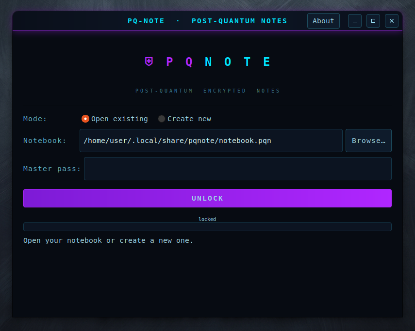

<div align="center">

# ⛨ PQ-Note

**Post-quantum encrypted notes for Linux — GTK3.**

<a href="https://github.com/effjy/pq-note"></a>
<a href="https://github.com/effjy/pq-note"></a>
<a href="https://github.com/effjy/pq-note"></a>
<a href="https://github.com/effjy/pq-note"></a>
<a href="https://github.com/effjy/pq-note"></a>
<a href="https://github.com/effjy/pq-note"></a>
<a href="https://github.com/effjy/pq-note/releases"></a>

A single master password unlocks a notebook of free-form notes, sealed as one
AEAD blob behind an optional **Kyber-1024 + X448 hybrid KEM** and an Argon2id
master key. Nothing decrypted ever touches the disk.

<br>



</div>

---

## Features

- **Encrypted notebook** — every note (title + body) is serialized and sealed
  as a single **AES-256-GCM** or **XChaCha20-Poly1305** AEAD blob. One file,
  one master password.
- **Post-quantum hybrid KEM (optional)** — the AEAD key comes from a
  **Kyber-1024 (NIST level 5) + X448** key encapsulation whose secret key is
  wrapped with your Argon2id master key. Secure as long as *either* primitive
  holds, so your notes stay private against a future quantum adversary.
- **Argon2id master key** — Basic (256 MiB), Medium (1 GiB) or Strong (4 GiB)
  presets; the slow derivation runs on a worker thread so the UI never freezes.
- **Memory-hardened** — the master password and all plaintext live in
  libsodium guarded, **locked, non-dumpable** memory and are zeroed on
  lock/exit. Core dumps are disabled at startup. Saves are written via a temp
  file + `fsync` + atomic rename, so a crash never corrupts an existing notebook.
- **Simple UI** — searchable note list on the left, full-height title/body
  editor on the right. Add, edit, delete, save, lock.

---

## Prerequisites

PQ-Note needs GTK3, libsodium, libargon2 and OpenSSL (libcrypto, for X448),
plus the usual C build tools (`gcc`/`cc`, `make`, `pkg-config`).

**Debian / Ubuntu / Mint**
```sh
sudo apt install build-essential pkg-config \
    libgtk-3-dev libsodium-dev libargon2-dev libssl-dev
```

**Fedora / RHEL**
```sh
sudo dnf install gcc make pkgconf-pkg-config \
    gtk3-devel libsodium-devel libargon2-devel openssl-devel
```

**Arch / Manjaro**
```sh
sudo pacman -S base-devel gtk3 libsodium argon2 openssl
```

---

## Build & install

```sh
git clone https://github.com/effjy/pq-note.git
cd pq-note
make                 # builds the ./pqnote binary
```

Run it straight from the build directory:

```sh
./pqnote
```

Or install globally — binary, scalable + raster icons, and an applications-menu
entry (so PQ-Note shows up in your launcher and taskbar):

```sh
sudo make install          # installs to /usr/local by default
```

Install to your home directory instead of system-wide:

```sh
make install PREFIX=$HOME/.local
```

Remove everything that was installed:

```sh
sudo make uninstall        # match the PREFIX you installed with
```

---

## Usage

1. **Launch** PQ-Note. On the lock screen choose **Create new**, pick a
   notebook file, set a master password, choose the cipher / key strength /
   hybrid PQC, and click **CREATE NOTEBOOK**.
2. **Write a note** — click **✚ New**, type a title and body, then **ADD
   NOTE**. Notes are held in memory until you click **💾 Save Notebook**, which
   encrypts and writes them to disk.
3. **Edit / delete** — select a note from the list to load it into the editor;
   change it and **SAVE CHANGES**, or **Delete** it. Use the search box to
   filter the list by title.
4. **Lock** — **🔒 Lock** wipes the session from memory and returns to the lock
   screen. Reopen the same file with the same password to decrypt your notes.

> The default notebook lives at `~/.local/share/pqnote/notebook.pqn`. You can
> keep as many separate notebook files as you like, each with its own password.

---

## Notebook file format

```
magic "PQNOTE\0\0" | format version | cipher id | KDF id/level | Argon2 params |
salt | [hybrid block: wrapped Kyber+X448 secret key + KEM ciphertext] |
AEAD nonce | ciphertext length | AEAD( serialized notes )
```

The serialized plaintext is `"PQNV"` + version + note count, then each note as
length-prefixed fields. A wrong password fails on the hybrid wrap tag (hybrid
notebooks) or the AEAD tag (classical), so tampering and bad passwords are
always caught.

---

## Credits

The cryptographic engine (vault format, hybrid KEM, Kyber-1024 reference,
guarded-memory entry buffer) is shared with
[PQPMan](https://github.com/effjy/pqpman); PQ-Note reuses it for notes instead
of passwords.

---

<div align="center">
<sub>© 2026 Jean-Francois Lachance-Caumartin · MIT License</sub>
</div>
